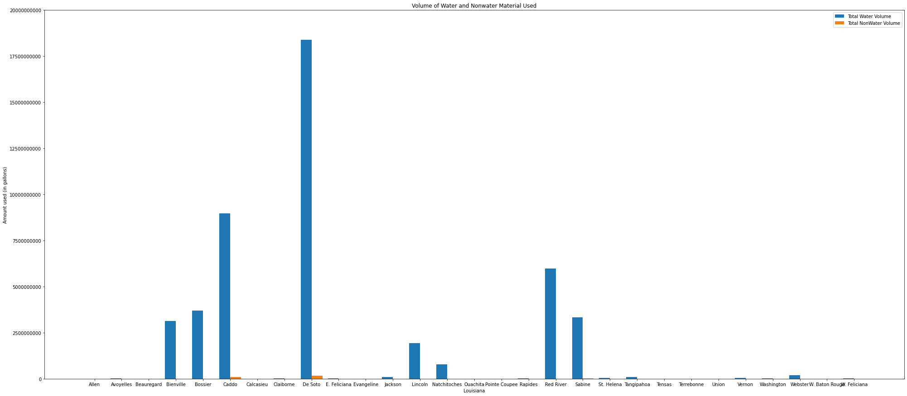

# CaseStudy2 - FracFocus

## Introduction
In this case study, I am given a dataset from [FracFocus](https://fracfocus.org/data-download) and am tasked to run a statistical analysis of my choosing to make sense of the raw data. As the dataset is very large, I first clean the data and get rid of the attributes that did not contribute to my analysis.
I wanted to focus on the water and nonwater susbtances used in the base of the hydraulic system of each well that was used in the fracking jobs. To do this, I grouped together the wells by the counties they were located in and then I grouped together the counties into the individual states they are located in. The reason I focused on water was because, while it plays a crucial role in fracking and drilling, it is also a key resource for local communities. It is important that the Operators of the wells use the fresh water resource responsibly and make sure that the water supply is not negatively impacted by their use.  

## Tools Used
To conduct my analysis, I used Jupyter Notebook to write clean and concise `Python` code to read the data, cleaned it apporopriately and then ran my analysis on the cleaned data. I used `Pandas DataFrame` to read and store the data and `matplotlib` to create insightful graphs about the volume of water and nonwater substances used by the different wells around the United States. 

## Findings and Graphs
**State that used the least amount of water:** Idaho  
  * The state of Idaho had only one county that drilled and only used 727 gallons of water.  

**State that used the most amount of water:** Texas   
  * The state of Texas has wells in 188 different counties and used almost 650 billion gallons of water. Out of the counties in Texas, Midland used the most water; close to 73 billion gallons of water.  

### Graphs of Counties in Each State

  
 Alabama Water Consumption

  Alaska's Water Consumption

  Arkansas's Water Consumption

  California's Water Consumption

  Colorado's Water Consumption

  Idaho's Water Consumption

  Illinois's Water Consumption

  Indiana's Water Consumption

  Kansas's Water Consumption

  Kentucky's Water Consumption

  Louisiana's Water Consumption

  Michigan's Water Consumption

  Mississippi's Water Consumption

  Montana's Water Consumption

  North Carolina's Water Consumption

  North Dakota's Water Consumption

  New York's Water Consumption

  Nebraska's Water Consumption

  Nevada's Water Consumption

  New Mexico's Water Consumption

  Ohio's Water Consumption

  Oklahoma's Water Consumption

  Pennsylvania's Water Consumption

  Texas's Water Consumption

  Utah's Water Consumption

  Virgina's Water Consumption

  West Virgina's Water Consumption

  Wyoming's Water Consumption

### Graph of the States Usage of Water

  Water Consumption by State

## Conclusion
There are many interesting conclusions that can be drawn from this data that can help businesses make insightful descisions or allocate resources to the wells that need it most. In my analysis, I wanted to focus on the amount of water and nonwater materials used in well jobs. Water is, arguably, our most precious resource but not most abundant, and so, we must use it wisely. With this data, one can determine how severely the location's fracking activity is having on the local water supply. Another use case for this data is to be used as a factor in determining whether to increase drilling in a specific location. An operator may choose to not continue fracking if a lot of water needs to be used at the specific location.
 
## Other Areas to Analyze
There are many other areas I had wished to analyze, however, with the constraint of time and resources, I have limited my analysis on just the usage of water. If there was another area I could have focused my analysis on, it would be about the materials used in the wells for different purposes. For example, many wells used Crystalline Silica Quartz as a proppant, others used Coconut Diethanolamide as a non-emulsifying acid. After grouping all the materials by their location, businesses can use this knowledge to determine what materials are needed where. 

