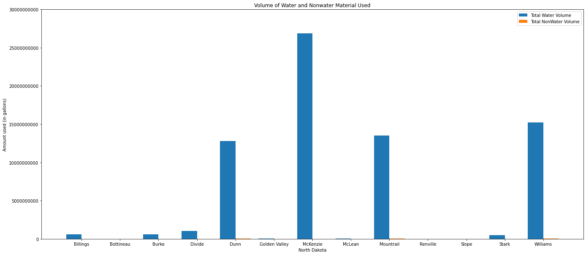

# CaseStudy2 - FracFocus

## Introduction
This Case Study involves running Statistical Analysis on a Dataset provided by FracFocus, a industry leading provider of chemical disclosures in national hydraulic fracturing. 
- Due to large size of dataset and to address performance issue, the data is first cleansed and the attributes normalized
  - Attributes were normalized using the min-max normalization
  - Target data was binned so that understanding the distribution was made easier
- Focus on water and non-water substance’s used in the base of the hydraulic system of each well used in the fracking jobs
- Wells were grouped by the demographic data grouped by State and County
- Water has vital role in fracking and drilling, as also is a key resource for local communities. It is important that the Well Operators assume the social responsibility of the balanced use of fresh water
## Prerequisite
Many components of this project are best viewed in light mode therefore it is required that viewers have their system setting in light mode (dark mode is not recommended).
## Tools Used
`Jupyter Notebook` was used to:
- Write clean and concise `Python` code to read the data
- Run analysis on the cleaned data
 
`Pandas DataFrame` was used to:
 - Read and store the data 

`matplotlib` was used to:  
 - Create insightful graphs about the analyzed data 

## Findings and Graphs
**State that used the least amount of water:** Idaho  
  * The state of Idaho had only one county that drilled and only used 727 gallons of water.  

**State that used the most amount of water:** Texas   
  * The state of Texas has wells in 188 different counties and used almost 650 billion gallons of water. Out of the counties in Texas, Midland used the most water; close to 73 billion gallons of water.  

### Graphs of Counties in Each State

  
 Alabama Water Consumption

  Alaska's Water Consumption

  Arkansas's Water Consumption

  California's Water Consumption

  Colorado's Water Consumption

  Idaho's Water Consumption

  Illinois's Water Consumption

  Indiana's Water Consumption

  Kansas's Water Consumption

  Kentucky's Water Consumption

  Louisiana's Water Consumption

  Michigan's Water Consumption

  Mississippi's Water Consumption

  Montana's Water Consumption

  North Carolina's Water Consumption

  North Dakota's Water Consumption

  New York's Water Consumption

  Nebraska's Water Consumption

  Nevada's Water Consumption

  New Mexico's Water Consumption

  Ohio's Water Consumption

  Oklahoma's Water Consumption

  Pennsylvania's Water Consumption

  Texas's Water Consumption

  Utah's Water Consumption

  Virgina's Water Consumption

  West Virgina's Water Consumption

  Wyoming's Water Consumption

### Graph of the States Usage of Water

  Water Consumption by State

## Conclusion
Several insights can be drawn from this analysis
  - Resources needed to be allocated at the Well level
  - Appropriate usage of planet’s most critical commodity i.e. Water
  - Impact of fracking activity at precise geo location level
  - Areas of expansion of drilling activity by location
  - Discontinuation of fracking activity of non-performing Well
## Other Areas to Analyze
Due to the constraint of time and resources, this analysis has been limited to just the usage of water.  
Other areas to analyze: 
- Grouping materials used in the wells by location 
  - Many wells used Crystalline Silica Quartz as a proppant, others used Coconut Diethanolamide as a non-emulsifying acid. 
  - After grouping, businesses can determine what materials are needed where and therefore allocate their own supplies to the places of high demand. 

